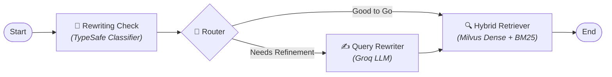

# ⚡ CRAG: Corrective RAG with LangGraph

> A modular, intelligent **Corrective Retrieval-Augmented Generation (CRAG)** pipeline built with **LangGraph**, **Milvus Lite**, **Typesafe JEV**, and **Groq**.

---

## 🧭 Workflow



---

## ✨ Features

- 🧠 **Adaptive Query Classification**: Evaluates input clarity & retrieval-readiness using `TypeSafeClassifier`.
- ✍️ **Intelligent Query Rewriting**: Expands vague prompts into keyword-rich retrieval queries using Groq-powered LLMs.
- 🎯 **Hybrid Search Engine**: Combines dense semantic embeddings (`multilingual-e5-base`) and lexical BM25 sparse search in **Milvus Lite**.
- 📑 **Semantic Chunking**: Context-aware document splitting via `SemanticChunker` & `PyMuPDF`.
- 🔄 **Graph-Based Orchestration**: Transparent, stateful control flow powered by **LangGraph**.

---

## 🛠️ Tech Stack

| Component | Technology |
|---|---|
| **Orchestration** | [LangGraph](https://github.com/langchain-ai/langgraph) |
| **LLM Engine** | [Groq](https://groq.com/) (`ChatGroq`) |
| **System-1 Evaluation** | [TypeSafe Classifier](https://github.com/langchain-ai) |
| **Vector Database** | [Milvus Lite](https://milvus.io/) (Dense + BM25 Sparse) |
| **Embeddings** | [HuggingFace](https://huggingface.co/) (`intfloat/multilingual-e5-base`) |
| **Environment & Package Mgmt** | [uv](https://github.com/astral-sh/uv) |

---

## 🚀 Quick Start

### 1. Prerequisites & Installation

Clone the repository and install dependencies with `uv`:

```bash
git clone https://github.com/gauravgulia26/rag_langgraph.git
cd rag_langgraph
uv sync
```

### 2. Environment Setup

Create a `.env` file in the project root:

```env
GROQ_API_KEY=your_groq_api_key
TYPESAFE_API_KEY=your_typesafe_api_key
HUGGINGFACEHUB_API_TOKEN=your_hf_token
```

### 3. Run Pipeline

Run the end-to-end ingestion and CRAG workflow:

```bash
uv run python main.py
```

---

## 📁 Repository Structure

```
├── config/              # Model and path configurations
├── data/                # Source documents (e.g. nep2020.pdf)
├── database/            # Local Milvus Lite vector database
├── src/rag_langgraph/
│   ├── application/     # Chains and prompts
│   ├── config/          # Centralized configuration & path loaders
│   ├── db/              # Vector store initialization
│   ├── graph/           # LangGraph state, builder, and nodes
│   ├── infra/           # Document loading, semantic chunking & ingestion
│   ├── models/          # LLM & embedding model factories
│   ├── retrievers/      # Hybrid retriever setup
│   └── utils/           # Helper utilities
└── main.py              # Application entrypoint
```
